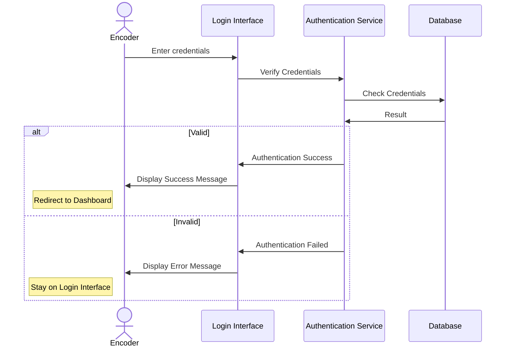
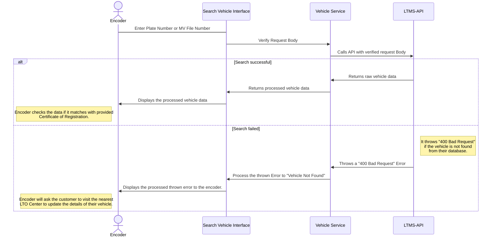

# Encoder Application Workflow

## User/Encoder Feature Flow

> [!NOTE]
> If this doesn't render in your screen, please visit [Mermaid Live
> Editor](https://mermaid.live/edit) and copy the code block.

## Vehicle Feature Flow

> [!NOTE]
> If this doesn't render in your screen, please visit [Mermaid Live
> Editor](https://mermaid.live/edit) and copy the code block.
